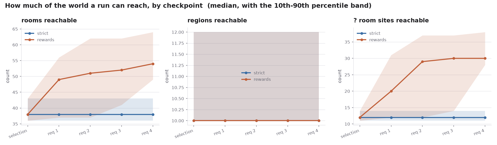
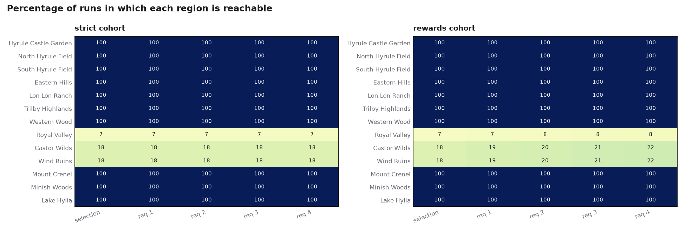
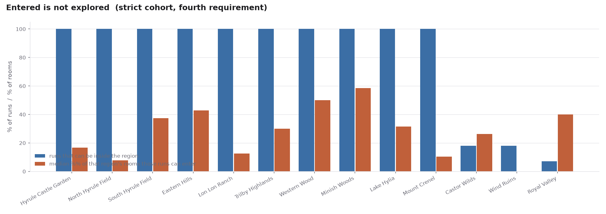
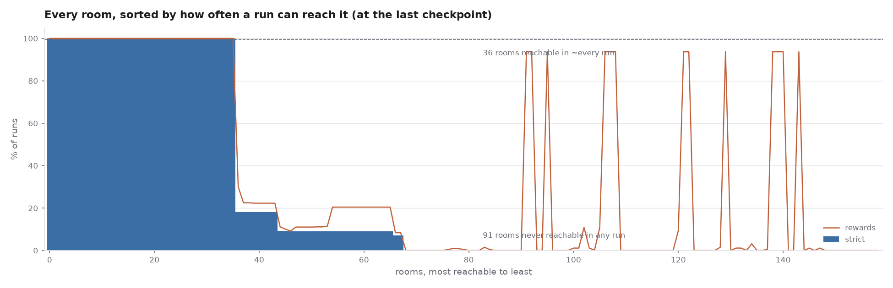
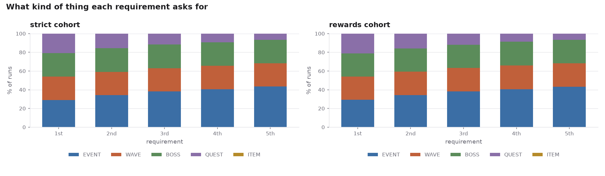
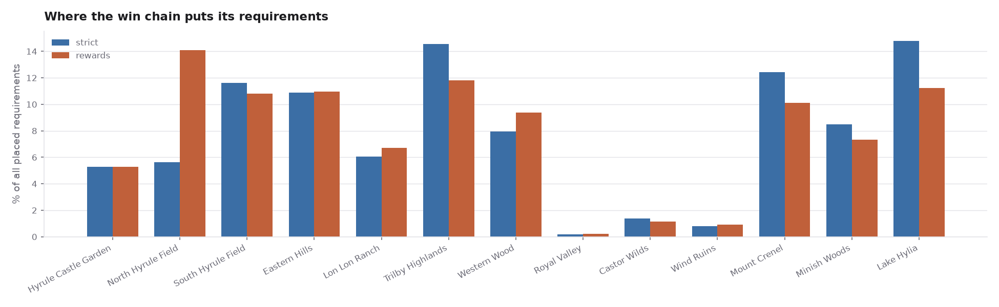
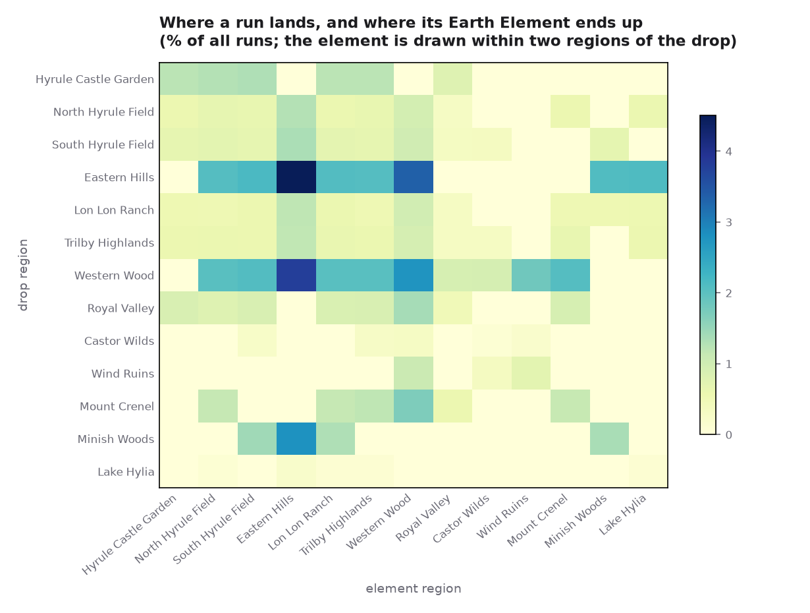
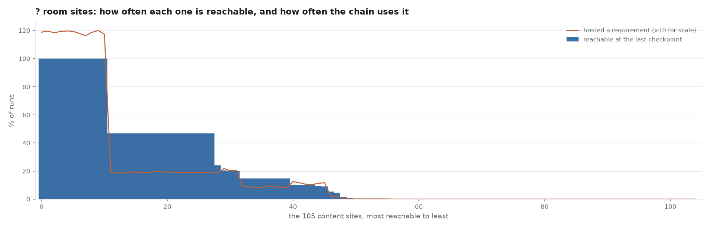
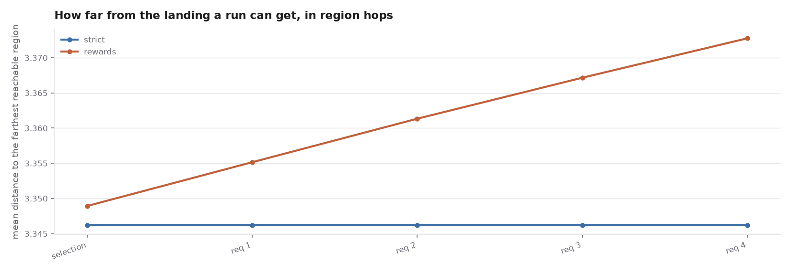
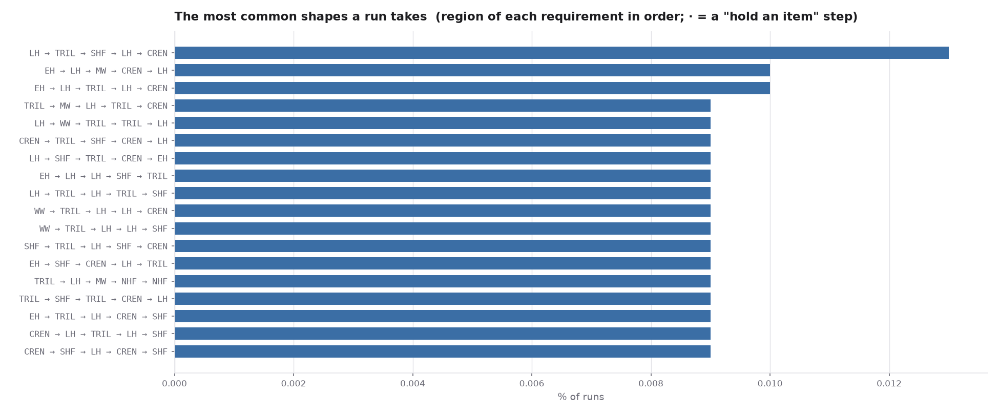

# What 100,000 simulated runs say about this game

100,000 runs - 50,000 in each of two loadout cohorts - played through the three hub selection rounds and all five Earth Element requirements, with reachability measured at five checkpoints.

Generated by `tools/quickstart/sim_report.py` from `tools/quickstart/sim.py`. The reach model is validated against the shipped ROM by `tools/quickstart/sim_validate.py` - 402 of 402 random cases agree.


## Headline findings

This is the SECOND pass. The first one reported that the reachable world never grows and that three regions were priced absurdly; the user pushed back on both, and was right on both. What changed, and what the corrected model says, is below. The errors are kept on the record in "What the first pass got wrong" rather than quietly overwritten.

**1. The world does grow, and the region clear is what grows it.** Not the chain. Across 500,000 requirement rolls (100,000 runs x 5) the chain dealt ITEM **0 times** - there is always a placed candidate of another kind, so the branch the code calls "the guaranteed floor and the reason the chain can never wedge" is unreachable in practice. But `QuickStartSpawnRegionRewardItem` draws over `QS_CAT_ALL`, which includes key items, and every WAVE and BOSS step is a region clear. Modelling that draw faithfully, a run goes from 39.6 reachable rooms after the hub to 54.2 by the fourth requirement. The placer sees it too, because `QuickStartChainRollStep` is called from the previous step's completion and reads the live inventory. So the escalation the design wants is happening - it just runs through the loot table rather than through the ITEM step written for it.

**2. The ITEM step is still dead, and that is still worth deciding about.** 0 rolls in 500,000. It is the only *guaranteed* grant in the chain; everything the region clear pays is a 64-way draw that may hand over a bottle. The floor is the strict cohort, which assumes a player picks up nothing: 39.6 rooms after the hub and 39.6 by the fourth requirement - flat, because with no ITEM step nothing in the chain itself opens a door.

**3. The duplicate-quest bug is fixed.** The first pass measured 15,827 of 50,000 runs (31.7%) being dealt the side quest as two separate requirements; the second copy was already satisfied when it landed, so those runs silently lost one of their five steps. The guard asked `QuickStartChainAlreadyUsed(step, QS_CHAIN_QUEST, 0)` while the store wrote `chain_where[step] = QuickStartQuestSlot()`, so it only ever matched the 1 run in 18 whose quest sits in pool row 0 - and of the 15,827 duplicate runs, zero had slot 0. The guard now asks about the slot. This sweep, run against the fixed logic, reports **0** duplicate-quest runs in 100,000.

**4. Two regions were priced wrongly, and the cause is structural.** Hyrule Castle Garden had no survey block at all, so `gen_reach` priced it "never" and the chain believed the one region of the ring that costs nothing to walk into was permanently out of reach - it was counted reachable in 7% of runs, exactly the share that DROP there. Royal Valley was priced FREE and counted reachable in 100% of runs, when its only crossing wants bombs and the Power Bracelets. Both are the same bug: the region table was built from each region's `room_req`, which is the cost of moving around INSIDE it, and for a region whose entry price is recorded as an exit row in its NEIGHBOUR's block that price was simply not read. FIXED with an explicit `ENTRY` table plus a Castle Garden block.

**4b. Fixing the prices exposes a design question: Royal Valley is now nearly dead content.** With its real entry price in, it is reachable in 7% of runs and hosts 0.2% of all placed requirements. That is the honest number, not a bug - bombs AND the Power Bracelets is a steep toll for a spur with one way in - but a whole region, its graveyard, its maze and its dojo are now content most runs will never see. The lever is the toll: the crossing is priced that way because the walk to it runs through North Hyrule Field's TO_GRAVEYARD pocket, and a second route in (or a drop site inside the valley, which already exists) would change the picture without touching the survey.

**5. "Reachable" was measuring the wrong thing, and Mount Crenel is the proof.** `QuickStartReachPoolOk` asks only whether the player can be INSIDE a region, so a region that is free to enter scores as fully open even when everything past the entrance is priced. The mountain is free to walk into and its interior wants the Grip Ring. The report now measures both: how often a region can be entered, and what share of its rooms those runs can actually get into. See "Entered is not explored".

**6. Almost half the mapped world is still invisible to the chain.** 58 of 159 rooms and 48 of 105 ? room sites are never counted reachable under any loadout a run can assemble. Bombs joining `QS_CAT_KEY` this pass removes one of the two big causes; the untestable `MINISH` token is the other and is still open.


## The two cohorts

| cohort | what the player is assumed to hold |
|---|---|
| `strict` | the three hub picks, plus whatever the chain's own ITEM steps hand over. This is exactly what the placer sees, and a floor for reach. |
| `rewards` | the same, plus the actual region clear reward on every WAVE and BOSS step, drawn the way `QuickStartSpawnRegionRewardItem` draws it - `QuickStartDrawItem(Random() & 0x3f, QS_CAT_ALL)`, modelled over all 64 equiprobable seeds with the real tier curve and the real usability tests. Plus the fusion bit after the first clear. |

The truth is between them, and much nearer `rewards`: a player who finishes five requirements has cleared regions, and a region clear pays out. `strict` is kept because it is exactly what the placer would see if the player picked up nothing, which makes it the honest floor.


EVENT and QUEST steps are deliberately NOT modelled as growth. A "? room" pays `QS_CAT_DROP`, which excludes key items by construction, and a quest pays its own table; neither can move the reach mask.


## Reachability



- **strict**: median 38 of 159 rooms reachable after the item selection, 38 by the fourth requirement (10th-90th percentile 36-43).
- **rewards**: median 38 of 159 rooms reachable after the item selection, 54 by the fourth requirement (10th-90th percentile 49-64).




### What the model now believes a region costs to enter

Two of these were wrong until this pass, and both were caught by a reader rather than by the tooling, so the whole table is printed for audit. A row that looks wrong probably is: the entry price is what it costs to CROSS INTO the region, not what it costs to walk around inside once there.

| region | entry price | reachable in |
|---|---|---|
| Hyrule Castle Garden | `free` | 100% of runs |
| North Hyrule Field | `sword` | 100% of runs |
| South Hyrule Field | `free` | 100% of runs |
| Eastern Hills | `free` | 100% of runs |
| Lon Lon Ranch | `free` | 100% of runs |
| Trilby Highlands | `free` | 100% of runs |
| Western Wood | `free` | 100% of runs |
| Royal Valley | `bracelets + bombs` | 7% of runs |
| Castor Wilds | `cape or boots` | 18% of runs |
| Wind Ruins | `cape or boots` | 18% of runs |
| Mount Crenel | `free or bombs + grip` | 100% of runs |
| Minish Woods | `free or flippers + minish` | 100% of runs |
| Lake Hylia | `free or ocarina` | 100% of runs |


### Entered is not explored

The measure above asks whether a run can be INSIDE a region. That is also the only question `QuickStartReachPoolOk` asks, which means it is the question the chain uses when it decides where a WAVE or a BOSS step may go. It is not the same as how much of the region the player can walk.



| region | runs that can be inside it | median share of its rooms they can enter |
|---|---|---|
| North Hyrule Field | 100% | 8% |
| Mount Crenel | 100% | 10% |
| Lon Lon Ranch | 100% | 12% |
| Hyrule Castle Garden | 100% | 17% |
| Trilby Highlands | 100% | 30% |
| Lake Hylia | 100% | 32% |

One caveat before reading those numbers as gameplay, because the first pass of this report made exactly that mistake: the denominator is every room the survey attributes to the region, and a large share of those are Minish cracks and Minish houses that the reach model can never count (see "Rooms the reach model never counts"). So a low explorable share is partly a statement about the region and partly a statement about the `MINISH` token. North Hyrule Field is the clearest case of the second kind. Mount Crenel is the clearest case of the first: its interior is priced at the Grip Ring, which the model CAN test, so its gap is real.


The widest gaps are regions the chain treats as open and the player experiences as a doorstep. Mount Crenel is the designed example - free to walk into, Grip Ring for everything past the entrance - and it is worth deciding whether a wave or a boss placed "in Mount Crenel" should have to be placed somewhere the player can actually stand, or whether the entrance strip is enough (for a wave, which spawns around the player, it probably is; for a boss, which spawns at the region's fixed reward spot, it matters).




### Rooms the reach model never counts (58 of 159)

**Read this carefully, because the obvious reading is wrong.** These rooms are not sealed off in the world - a player can walk into most of them. What is true is that `QuickStartReachRoomOk` never returns TRUE for them under any loadout a run can assemble, which means the win chain can never place a requirement in one and the mode believes they are out of reach. That is a large fraction of the built world that the run structure cannot use.


#### Why, grouped by cause

| rooms | cause |
|---|---|
| **47** | needs a token with no run-time test: MINISH |
| **3** | needs a token with no run-time test: MAZE |
| **2** | every route is priced "never" in the survey |
| **2** | needs a token with no run-time test: UNSURVEYED |
| **2** | needs a token with no run-time test: BOULDER, MINISH |
| **1** | no row in the survey at all |
| **1** | needs a token with no run-time test: MINISH, UNSURVEYED |

- **`MINISH` has no run-time test** and is now the single largest cause. Being Minish is a state, not an inventory item, so `QuickStartHeldReachMask` can never set the bit and every term containing it is permanently false. That is a deliberate conservative choice in the reach model; the cost of it, measured here, is that a large block of rooms is invisible to the chain even though the player has a Minish Cap and the portals work. It is the one remaining decision that would move this number materially.
- **Bombs used to be the other big cause, and are not any more.** They were `QS_CAT_WEAPON` only, so neither hub round 1 (which draws `QS_CAT_KEY`) nor a chain ITEM step could ever hand them over, and fourteen bomb-priced rooms - the whole of Mount Crenel's base among them - sat outside the chain's reach for the life of a run. The row is `QS_CAT_WEAPON | QS_CAT_KEY` now: bombs stay a weapon for the shop and the "? room" drop pool and are a key item everywhere reach is decided. This run is measured with that change in.

<details><summary>All of them</summary>


| room | region |
|---|---|
| `BEANSTALKS/BEANSTALKS_EASTERN_HILLS` | MW |
| `CASTLE_GARDEN_MINISH_HOLES/CASTLE_GARDEN_MINISH_HOLES_0` | CG |
| `CASTLE_GARDEN_MINISH_HOLES/CASTLE_GARDEN_MINISH_HOLES_1` | CG |
| `CRENEL_CAVES/CRENEL_CAVES_BLOCK_PUSHING` | CREN |
| `CRENEL_CAVES/CRENEL_CAVES_BRIDGE_SWITCH` | CREN |
| `CRENEL_CAVES/CRENEL_CAVES_EXIT_TO_MINES` | CREN |
| `CRENEL_CAVES/CRENEL_CAVES_PILLAR_CAVE` | CREN |
| `CRENEL_MINISH_PATHS/CRENEL_MINISH_PATHS_BEAN` | CREN |
| `CRENEL_MINISH_PATHS/CRENEL_MINISH_PATHS_MELARI` | CREN |
| `CRENEL_MINISH_PATHS/CRENEL_MINISH_PATHS_RAIN` | CREN |
| `CRENEL_MINISH_PATHS/CRENEL_MINISH_PATHS_SPRING_WATER` | CREN |
| `DEEPWOOD_SHRINE_ENTRY/DEEPWOOD_SHRINE_ENTRY_MAIN` | MW |
| `GARDEN_FOUNTAINS/GARDEN_FOUNTAINS_EAST` | CG |
| `GARDEN_FOUNTAINS/GARDEN_FOUNTAINS_WEST` | CG |
| `GORON_CAVE/GORON_CAVE_STAIRS` | LLR |
| `HOUSE_INTERIORS_2/HOUSE_INTERIORS_2_DAMPE` | RV |
| `HOUSE_INTERIORS_4/HOUSE_INTERIORS_4_RANCH_HOUSE_EAST` | LLR |
| `MELARIS_MINE/MELARIS_MINE_MAIN` | CREN |
| `MINISH_CAVES/MINISH_CAVES_BEAN_PESTO` | CREN |
| `MINISH_CAVES/MINISH_CAVES_LAKE_HYLIA_LIBRARI` | LH |
| `MINISH_CAVES/MINISH_CAVES_LAKE_HYLIA_NORTH` | LH |
| `MINISH_CAVES/MINISH_CAVES_MINISH_WOODS_NORTH_1` | LH, MW |
| `MINISH_CAVES/MINISH_CAVES_MINISH_WOODS_SOUTHWEST` | MW |
| `MINISH_CAVES/MINISH_CAVES_OUTSIDE_LINKS_HOUSE` | SHF |
| `MINISH_CAVES/MINISH_CAVES_RUINS` | WR |
| `MINISH_CRACKS/MINISH_CRACKS_CASTOR_WILDS_BOW` | CW |
| `MINISH_CRACKS/MINISH_CRACKS_CASTOR_WILDS_MIDDLE` | CW |
| `MINISH_CRACKS/MINISH_CRACKS_CASTOR_WILDS_NEXT_TO_BOW` | CW |
| `MINISH_CRACKS/MINISH_CRACKS_CASTOR_WILDS_NORTH` | CW |
| `MINISH_CRACKS/MINISH_CRACKS_CASTOR_WILDS_WEST` | CW |
| `MINISH_CRACKS/MINISH_CRACKS_EAST_HYRULE_CASTLE` | NHF |
| `MINISH_CRACKS/MINISH_CRACKS_HYRULE_CASTLE_GARDEN` | CG |
| `MINISH_CRACKS/MINISH_CRACKS_LAKE_HYLIA_EAST` | LH |
| `MINISH_CRACKS/MINISH_CRACKS_LON_LON_RANCH_NORTH` | LLR |
| `MINISH_CRACKS/MINISH_CRACKS_MINISH_WOODS_SOUTH` | MW |
| `MINISH_CRACKS/MINISH_CRACKS_RUINS_ENTRANCE` | WR |
| `MINISH_CRACKS/MINISH_CRACKS_RUINS_TEKTITE` | WR |
| `MINISH_HOUSE_INTERIORS/MINISH_HOUSE_INTERIORS_HYRULE_FIELD_EXIT` | EH |
| `MINISH_HOUSE_INTERIORS/MINISH_HOUSE_INTERIORS_HYRULE_FIELD_SOUTHWEST` | WW |
| `MINISH_HOUSE_INTERIORS/MINISH_HOUSE_INTERIORS_LIBRARI` | LH |
| `MINISH_HOUSE_INTERIORS/MINISH_HOUSE_INTERIORS_MELARI_MINES_EAST` | CREN |
| `MINISH_HOUSE_INTERIORS/MINISH_HOUSE_INTERIORS_MELARI_MINES_SOUTHEAST` | CREN |
| `MINISH_HOUSE_INTERIORS/MINISH_HOUSE_INTERIORS_MELARI_MINES_SOUTHWEST` | CREN |
| `MINISH_HOUSE_INTERIORS/MINISH_HOUSE_INTERIORS_MINISH_WOODS_BOMB` | MW |
| `MINISH_HOUSE_INTERIORS/MINISH_HOUSE_INTERIORS_NEXT_TO_KNUCKLE` | TRIL |
| `MINISH_HOUSE_INTERIORS/MINISH_HOUSE_INTERIORS_SOUTH_HYRULE_FIELD` | SHF |
| `MINISH_PATHS/MINISH_PATHS_BOW` | CW |
| `MINISH_PATHS/MINISH_PATHS_LAKE_HYLIA` | LH |
| `MINISH_PATHS/MINISH_PATHS_LON_LON_RANCH` | LLR |
| `MINISH_VILLAGE/MINISH_VILLAGE_MAIN` | MW |
| `MT_CRENEL/MT_CRENEL_CAVERN_OF_FLAMES_ENTRANCE` | CREN |
| `ROYAL_VALLEY_GRAVES/ROYAL_VALLEY_GRAVES_GINA` | RV |
| `ROYAL_VALLEY_GRAVES/ROYAL_VALLEY_GRAVES_HEART_PIECE` | RV |
| `RUINS/RUINS_BELOW_FORTRESS_ENTRANCE` | WR |
| `RUINS/RUINS_ENTRANCE` | WR |
| `RUINS/RUINS_FORTRESS_ENTRANCE` | WR |
| `TEMPLE_OF_DROPLETS/TEMPLE_OF_DROPLETS_ENTRANCE` | LH |
| `TREE_INTERIORS/TREE_INTERIORS_WITCH_HUT` | MW |

</details>


### The 15 most reachable rooms - the staleness watchlist

| room | strict | rewards |
|---|---|---|
| `MINISH_WOODS/MINISH_WOODS_MAIN` | 100.0% | 100.0% |
| `MINISH_VILLAGE/MINISH_VILLAGE_SIDE_HOUSE_AREA` | 100.0% | 100.0% |
| `HYRULE_FIELD/HYRULE_FIELD_WESTERN_WOODS_SOUTH` | 100.0% | 100.0% |
| `HYRULE_FIELD/HYRULE_FIELD_SOUTH_HYRULE_FIELD` | 100.0% | 100.0% |
| `HYRULE_FIELD/HYRULE_FIELD_EASTERN_HILLS_CENTER` | 100.0% | 100.0% |
| `HYRULE_FIELD/HYRULE_FIELD_EASTERN_HILLS_SOUTH` | 100.0% | 100.0% |
| `HYRULE_FIELD/HYRULE_FIELD_EASTERN_HILLS_NORTH` | 100.0% | 100.0% |
| `HYRULE_FIELD/HYRULE_FIELD_LON_LON_RANCH` | 100.0% | 100.0% |
| `HYRULE_FIELD/HYRULE_FIELD_WESTERN_WOODS_CENTER` | 100.0% | 100.0% |
| `HYRULE_FIELD/HYRULE_FIELD_NORTH_HYRULE_FIELD` | 100.0% | 100.0% |
| `HYRULE_FIELD/HYRULE_FIELD_TRILBY_HIGHLANDS` | 100.0% | 100.0% |
| `HYRULE_FIELD/HYRULE_FIELD_WESTERN_WOODS_NORTH` | 100.0% | 100.0% |
| `LAKE_HYLIA/LAKE_HYLIA_MAIN` | 100.0% | 100.0% |
| `MINISH_PATHS/MINISH_PATHS_MINISH_VILLAGE` | 100.0% | 100.0% |
| `MT_CRENEL/MT_CRENEL_CENTER` | 100.0% | 100.0% |

### The 15 rarest rooms that are reachable at all

| room | strict | rewards |
|---|---|---|
| `MINISH_HOUSE_INTERIORS/MINISH_HOUSE_INTERIORS_SIDE_AREA` | 9.07% | 11.48% |
| `HOUSE_INTERIORS_4/HOUSE_INTERIORS_4_FARM_HOUSE` | 9.01% | 20.46% |
| `CRENEL_CAVES/CRENEL_CAVES_HELMASAUR_HALLWAY` | 9.01% | 20.46% |
| `CRENEL_CAVES/CRENEL_CAVES_MUSHROOM_KEESE` | 9.01% | 20.46% |
| `CAVES/CAVES_HILLS_KEESE_CHEST` | 9.01% | 20.46% |
| `CAVES/CAVES_HEART_PIECE_HALLWAY` | 9.01% | 20.46% |
| `CAVES/CAVES_BOTTLE_BUSINESS_SCRUB` | 9.01% | 20.46% |
| `CAVES/CAVES_TO_GRAVEYARD` | 9.01% | 20.46% |
| `CRENEL_CAVES/CRENEL_CAVES_LADDER_TO_SPRING_WATER` | 9.01% | 20.46% |
| `CRENEL_CAVES/CRENEL_CAVES_GRIP_RING` | 9.01% | 20.46% |
| `CRENEL_CAVES/CRENEL_CAVES_HINT_SCRUB` | 9.01% | 20.46% |
| `CAVES/CAVES_SOUTH_HYRULE_FIELD_FAIRY_FOUNTAIN` | 9.01% | 20.46% |
| `CAVES/CAVES_TRILBY_FAIRY_FOUNTAIN` | 9.01% | 20.46% |
| `ROYAL_VALLEY/ROYAL_VALLEY_FOREST_MAZE` | 7.10% | 8.39% |
| `ROYAL_VALLEY/ROYAL_VALLEY_MAIN` | 7.10% | 8.39% |

## What the chain asks for, and where






| region | % of placed requirements (strict) | (rewards) |
|---|---|---|
| Lake Hylia | 14.8% | 11.2% |
| Trilby Highlands | 14.5% | 11.8% |
| Mount Crenel | 12.4% | 10.1% |
| South Hyrule Field | 11.6% | 10.8% |
| Eastern Hills | 10.9% | 11.0% |
| Minish Woods | 8.5% | 7.3% |
| Western Wood | 8.0% | 9.4% |
| Lon Lon Ranch | 6.0% | 6.7% |
| North Hyrule Field | 5.6% | 14.1% |
| Hyrule Castle Garden | 5.3% | 5.3% |
| Castor Wilds | 1.4% | 1.2% |
| Wind Ruins | 0.8% | 0.9% |
| Royal Valley | 0.2% | 0.2% |

### The 15 rooms that host requirements most often

| room | share of all placed requirements |
|---|---|
| `MT_CRENEL/MT_CRENEL_ENTRANCE` | 5.63% |
| `HYRULE_FIELD/HYRULE_FIELD_LON_LON_RANCH` | 5.51% |
| `HYRULE_FIELD/HYRULE_FIELD_TRILBY_HIGHLANDS` | 5.50% |
| `HYRULE_FIELD/HYRULE_FIELD_SOUTH_HYRULE_FIELD` | 5.49% |
| `HYRULE_FIELD/HYRULE_FIELD_NORTH_HYRULE_FIELD` | 5.43% |
| `HYRULE_FIELD/HYRULE_FIELD_EASTERN_HILLS_NORTH` | 5.42% |
| `MINISH_WOODS/MINISH_WOODS_MAIN` | 5.30% |
| `CASTLE_GARDEN/CASTLE_GARDEN_MAIN` | 5.28% |
| `LAKE_HYLIA/LAKE_HYLIA_MAIN` | 5.20% |
| `CAVES/CAVES_TRILBY_HIGHLANDS` | 4.77% |
| `HYRULE_FIELD/HYRULE_FIELD_WESTERN_WOODS_SOUTH` | 2.65% |
| `HYRULE_FIELD/HYRULE_FIELD_WESTERN_WOODS_CENTER` | 2.64% |
| `HYRULE_FIELD/HYRULE_FIELD_EASTERN_HILLS_CENTER` | 2.62% |
| `HYRULE_FIELD/HYRULE_FIELD_WESTERN_WOODS_NORTH` | 2.61% |
| `HYRULE_FIELD/HYRULE_FIELD_EASTERN_HILLS_SOUTH` | 2.55% |




## ? room sites



- 48 of 105 sites were never reachable in any run.
- 48 were never chosen to host a requirement.

**Never reachable:**

| site | room | kind class |
|---|---|---|
| 16 | `DOJOS/DOJOS_GRIMBLADE` | LARGE |
| 17 | `GORON_CAVE/GORON_CAVE_STAIRS` | SMALL |
| 18 | `GORON_CAVE/GORON_CAVE_MAIN` | LARGE |
| 19 | `GORON_CAVE/GORON_CAVE_MAIN` | MINIBOSS |
| 20 | `GORON_CAVE/GORON_CAVE_MAIN` | MINIBOSS |
| 21 | `GORON_CAVE/GORON_CAVE_MAIN` | MINIBOSS |
| 23 | `HOUSE_INTERIORS_2/HOUSE_INTERIORS_2_LINKS_HOUSE_SMITH` | ANY |
| 27 | `HOUSE_INTERIORS_4/HOUSE_INTERIORS_4_RANCH_HOUSE_EAST` | SMALL |
| 29 | `MINISH_HOUSE_INTERIORS/MINISH_HOUSE_INTERIORS_MELARI_MINES_SOUTHWEST` | SMALL |
| 30 | `MINISH_CAVES/MINISH_CAVES_OUTSIDE_LINKS_HOUSE` | ANY |
| 31 | `MINISH_HOUSE_INTERIORS/MINISH_HOUSE_INTERIORS_SOUTH_HYRULE_FIELD` | SMALL |
| 32 | `CASTLE_GARDEN_MINISH_HOLES/CASTLE_GARDEN_MINISH_HOLES_0` | ELITE |
| 33 | `CASTLE_GARDEN_MINISH_HOLES/CASTLE_GARDEN_MINISH_HOLES_1` | ANY |
| 34 | `MINISH_CRACKS/MINISH_CRACKS_HYRULE_CASTLE_GARDEN` | SMALL |
| 35 | `GARDEN_FOUNTAINS/GARDEN_FOUNTAINS_EAST` | ANY |
| 36 | `GARDEN_FOUNTAINS/GARDEN_FOUNTAINS_WEST` | ANY |
| 37 | `MINISH_HOUSE_INTERIORS/MINISH_HOUSE_INTERIORS_HYRULE_FIELD_EXIT` | SMALL |
| 38 | `MINISH_HOUSE_INTERIORS/MINISH_HOUSE_INTERIORS_HYRULE_FIELD_SOUTHWEST` | SMALL |
| 48 | `MINISH_CRACKS/MINISH_CRACKS_EAST_HYRULE_CASTLE` | SMALL |
| 50 | `MINISH_PATHS/MINISH_PATHS_LON_LON_RANCH` | LARGE |
| 51 | `MINISH_CRACKS/MINISH_CRACKS_LON_LON_RANCH_NORTH` | SMALL |
| 52 | `MINISH_HOUSE_INTERIORS/MINISH_HOUSE_INTERIORS_NEXT_TO_KNUCKLE` | SMALL |
| 53 | `HOUSE_INTERIORS_2/HOUSE_INTERIORS_2_DAMPE` | SMALL |
| 54 | `GREAT_FAIRIES/GREAT_FAIRIES_GRAVEYARD` | SMALL |
| 55 | `ROYAL_VALLEY_GRAVES/ROYAL_VALLEY_GRAVES_HEART_PIECE` | SMALL |
| 56 | `ROYAL_VALLEY_GRAVES/ROYAL_VALLEY_GRAVES_GINA` | ANY |
| 60 | `MINISH_PATHS/MINISH_PATHS_BOW` | SMALL |
| 61 | `MINISH_CRACKS/MINISH_CRACKS_CASTOR_WILDS_BOW` | SMALL |
| 62 | `MINISH_CRACKS/MINISH_CRACKS_CASTOR_WILDS_NORTH` | SMALL |
| 63 | `MINISH_CRACKS/MINISH_CRACKS_CASTOR_WILDS_WEST` | SMALL |
| 64 | `MINISH_CRACKS/MINISH_CRACKS_CASTOR_WILDS_MIDDLE` | SMALL |
| 65 | `MINISH_CRACKS/MINISH_CRACKS_RUINS_ENTRANCE` | SMALL |
| 73 | `CRENEL_CAVES/CRENEL_CAVES_EXIT_TO_MINES` | SMALL |
| 74 | `CRENEL_CAVES/CRENEL_CAVES_BLOCK_PUSHING` | SMALL |
| 80 | `CRENEL_MINISH_PATHS/CRENEL_MINISH_PATHS_SPRING_WATER` | LARGE |
| 83 | `TREE_INTERIORS/TREE_INTERIORS_WITCH_HUT` | SMALL |
| 84 | `DEEPWOOD_SHRINE/DEEPWOOD_SHRINE_ENTRANCE` | ANY |
| 85 | `MINISH_CAVES/MINISH_CAVES_MINISH_WOODS_SOUTHWEST` | ANY |
| 86 | `BEANSTALKS/BEANSTALKS_EASTERN_HILLS` | SMALL |
| 90 | `MINISH_HOUSE_INTERIORS/MINISH_HOUSE_INTERIORS_LIBRARI` | SMALL |
| 91 | `MINISH_CAVES/MINISH_CAVES_LAKE_HYLIA_NORTH` | ANY |
| 92 | `CRENEL_CAVES/CRENEL_CAVES_FAIRY_FOUNTAIN` | ANY |
| 94 | `CRENEL_CAVES/CRENEL_CAVES_CHUCHU_POT_CHEST` | LARGE |
| 95 | `CRENEL_CAVES/CRENEL_CAVES_SPINY_CHU_PUZZLE` | LARGE |
| 96 | `CRENEL_CAVES/CRENEL_CAVES_WATER_HEART_PIECE` | SMALL |
| 97 | `GREAT_FAIRIES/GREAT_FAIRIES_CRENEL` | ANY |
| 100 | `MINISH_CAVES/MINISH_CAVES_MINISH_WOODS_NORTH_1` | LARGE |
| 102 | `MINISH_HOUSE_INTERIORS/MINISH_HOUSE_INTERIORS_MINISH_WOODS_BOMB` | SMALL |

### The 12 sites the chain leans on most

| site | room | reachable | hosted |
|---|---|---|---|
| 88 | `HOUSE_INTERIORS_4/HOUSE_INTERIORS_4_MAYOR_LAKE_CABIN` | 100.0% | 12.00% |
| 24 | `HOUSE_INTERIORS_2/HOUSE_INTERIORS_2_LINKS_HOUSE_BEDROOM` | 100.0% | 11.96% |
| 14 | `CAVES/CAVES_TRILBY_HIGHLANDS` | 100.0% | 11.95% |
| 87 | `HOUSE_INTERIORS_2/HOUSE_INTERIORS_2_STOCKWELL_LAKE_HOUSE` | 100.0% | 11.94% |
| 22 | `HOUSE_INTERIORS_2/HOUSE_INTERIORS_2_LINKS_HOUSE_ENTRANCE` | 100.0% | 11.92% |
| 13 | `CAVES/CAVES_TRILBY_HIGHLANDS` | 100.0% | 11.88% |
| 81 | `MT_CRENEL/MT_CRENEL_CENTER` | 100.0% | 11.86% |
| 9 | `TREE_INTERIORS/TREE_INTERIORS_PERCYS_TREEHOUSE` | 100.0% | 11.84% |
| 89 | `MINISH_HOUSE_INTERIORS/MINISH_HOUSE_INTERIORS_LAKE_HYLIA_OCARINA` | 100.0% | 11.79% |
| 99 | `MINISH_HOUSE_INTERIORS/MINISH_HOUSE_INTERIORS_BARREL_MINISH` | 100.0% | 11.73% |
| 72 | `CAVE_OF_FLAMES/CAVE_OF_FLAMES_ENTRANCE` | 100.0% | 11.62% |
| 103 | `DOJOS/DOJOS_WAVEBLADE` | 20.3% | 2.18% |




## The bug this turned up, and its fix

The first pass measured **15,827 of 50,000 runs (31.7%)** being dealt the side quest as TWO separate requirements. There is only one quest per run, so the second copy was already satisfied the moment it was dealt and the run silently lost one of its five steps. The cause was a two-line mismatch in `QuickStartChainRollStep`'s helpers:

```c
// the guard asked whether where == 0 ...
!QuickStartChainAlreadyUsed(step, QS_CHAIN_QUEST, 0)

// ... but the store writes the pool row, which is 0 in only 1 case of 18
gSave.chain_where[step] = (u8)QuickStartQuestSlot();
```

The simulation agreed exactly with that reading: of the 15,827 duplicate runs, **zero** had a quest slot of 0. The comment above the guard reads "One quest per run", so the intent was never in doubt.

The guard now asks about `(u8)QuickStartQuestSlot()`. Over this run of 100,000 the simulator, carrying the same fix, reports **0** duplicate-quest runs.


## What the first pass got wrong

Three of the four headline findings in the first version of this report were wrong or badly overstated, and all three were caught by the user reading them rather than by the tooling. They are recorded here because the failure mode is worth keeping: in each case the simulation faithfully reproduced what the code does, and the error was in what the measurement was taken to MEAN.

| the claim | why it was wrong |
|---|---|
| "The reachable world does not grow." | It does. Every WAVE and BOSS step is a region clear, and `QuickStartSpawnRegionRewardItem` draws over `QS_CAT_ALL`, key items included. The chain rolls one step at a time off the live inventory, so the placer sees those grants. What the first pass measured was a cohort defined to pick nothing up; its flatness was a tautology, not a finding. The reward draw is now modelled exactly. |
| "Castle Garden is reachable in 7% of runs." | True as measured, and the measurement was of a data gap, not of the world. Castle Garden had no survey block, so it was priced "never" and only a run that DROPPED there ever saw it. The crossing from North Hyrule Field is a plain border with no gate. |
| "Royal Valley and Mount Crenel are reachable in 100% of runs." | Royal Valley was priced FREE when its only crossing wants bombs and the Power Bracelets. Mount Crenel is genuinely free to ENTER, but the number was reported as if it meant the region was open, when everything past the entrance is priced at the Grip Ring. Both are now measured properly - the first as a corrected entry price, the second with a separate explorability measure. |

The common root of the two pricing errors: `gen_reach` built the region entry table from each region's own `room_req`, which is the cost of moving around INSIDE a region. For a region whose entry price is recorded as an exit row in its NEIGHBOUR's survey block, that price was never read. `world_reach.ENTRY` now states crossings directly.


## The shape of a run



- 61,950 distinct requirement-region sequences across 100,000 runs.
- the most common accounts for 0.01% of runs.
- 38,707 sequences occurred exactly once.

## Appendix: what is modelled, and what is a distribution

Two systems key off the live RNG stream rather than the run seed, so no seed-driven model can say what a particular run gets. For those this reports the distribution the tables deal, which is the honest form of "what can be encountered".


### ? room kinds, in sixteenths

A site's kind class decides which draw it uses. Read off the switch statements in `QuickStartPickSmallKind` and friends.


| class | WAVES | MINIBOSS | NPC | POT_LOTTERY | GATE | FAIRY |
|---|---|---|---|---|---|---|
| SMALL | 7 | - | 3 | 3 | - | 1 |
| LARGE | 7 | 6 | - | - | 2 | 1 |
| ANY | 4 | 5 | 2 | 1 | 3 | 1 |

Site classes in the table: SMALL x59, ANY x31, LARGE x10, MINIBOSS x3, RARE x1, ELITE x1.


### Enemy rosters

Wave composition is an archetype roll cast from the difficulty tier's roster, so what a given wave contains is a live-RNG question. What IS fixed is the roster each tier draws from:


| level | distinct enemies |
|---|---|
| 1 | 10 |
| 2 | 15 |
| 3 | 17 |
| 4 | 12 |
| 5 | 11 |

A difficulty-3 run - the shipped build - draws mostly from levels 1-3, so roughly forty distinct enemy kinds are in play across a run, and the mix inside a wave is shaped by the archetype roll rather than picked flat.

